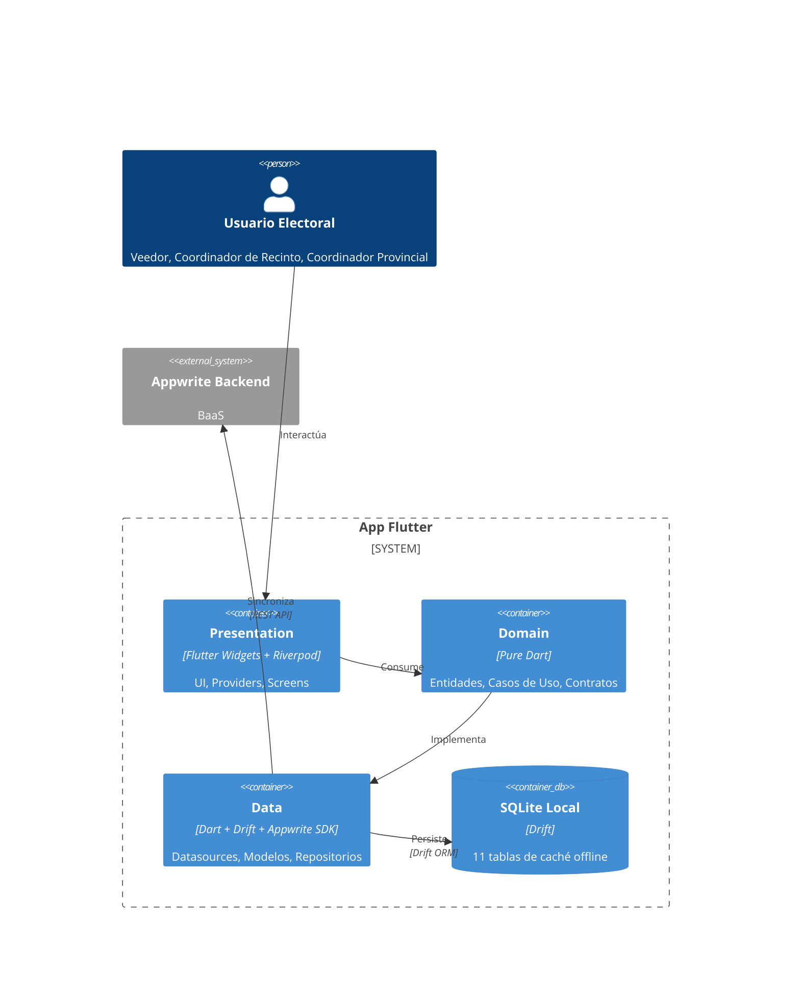
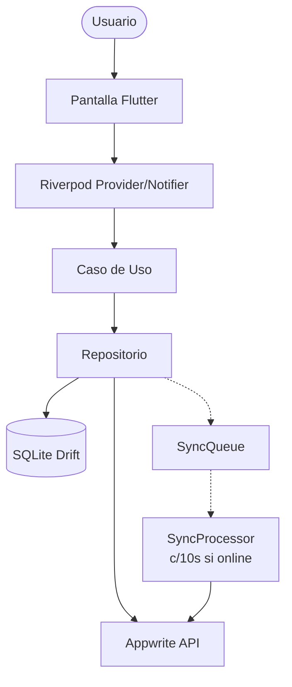
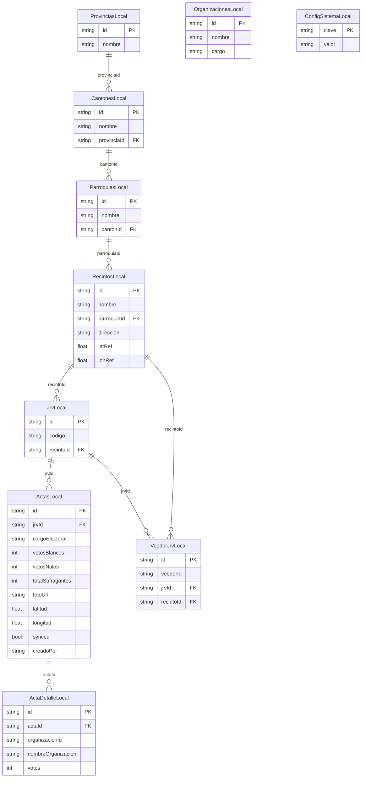
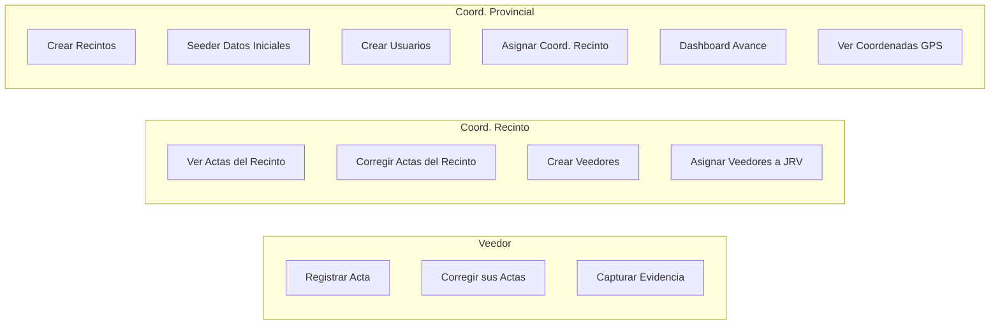
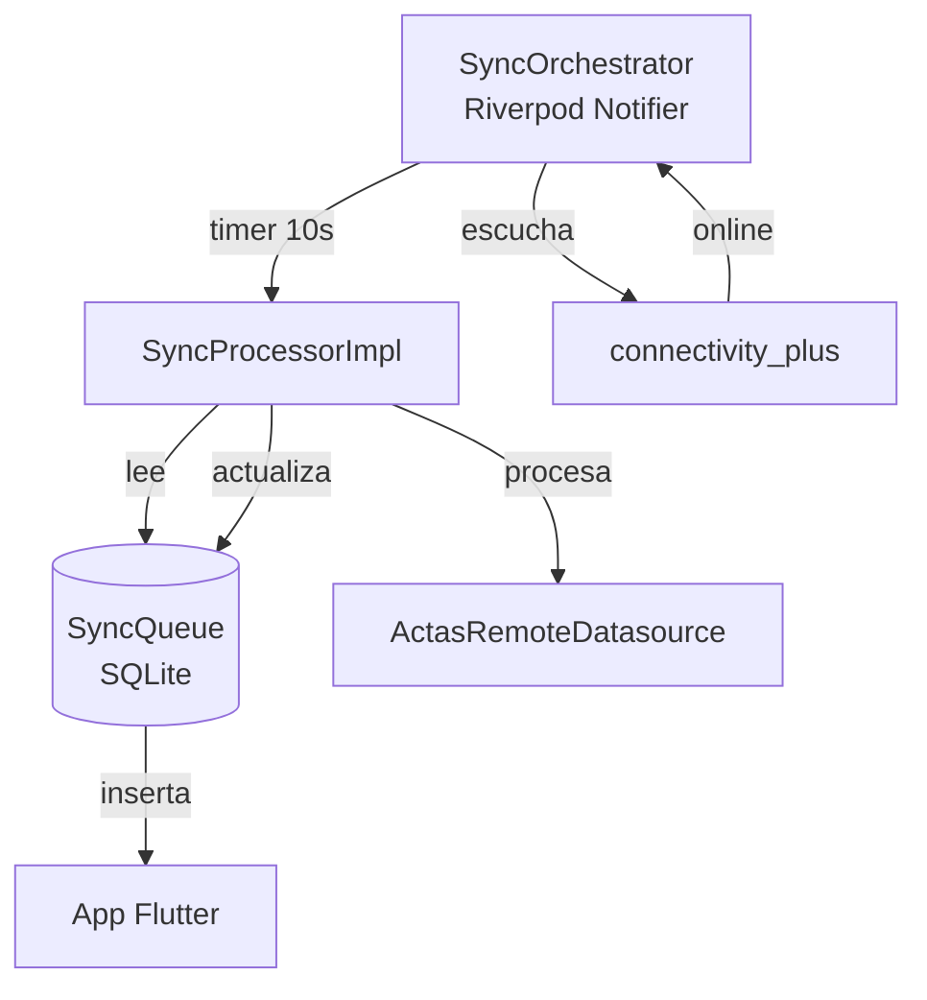

# Arquitectura — Control Electoral Ecuador

## Diagrama de Capas

## Stack Tecnológico

| Capa | Tecnología | Propósito |
|------|-----------|-----------|
| UI | Flutter 3.x + Material 3 | Renderizado multiplataforma |
| Estado | Riverpod 2.x + Freezed | DI, estado global, notificadores |
| Ruteo | GoRouter | Navegación declarativa con guards de autenticación |
| Local DB | Drift (SQLite) | Caché offline-first (11 tablas) |
| Backend | Appwrite | Auth, DB, Storage, Functions |
| Sync | SyncQueue + SyncProcessor | Cola de operaciones offline |
| GPS | geolocator | Captura de coordenadas |
| Cámara | camera + google_mlkit_text_recognition | Evidencia fotográfica con análisis de nitidez |

## Flujo de Datos — Offline First

## Modelo de Datos (Drift — SQLite Local)

## Colecciones Appwrite

| Colección | Uso |
|-----------|-----|
| `usuarios` | Perfiles de usuario (rol, cédula, etc.) |
| `provincias` / `cantones` / `parroquias` / `recintos` / `jrv` | Jerarquía geográfica |
| `organizaciones_politicas` | Catálogo de listas electorales |
| `actas` + `acta_detalle` | Resultados electorales |
| `veedor_jrv` | Asignación veedor ↔ mesa |
| `config_sistema` | Flags del sistema (seed ejecutado) |
| `evidencia_fotografica` (bucket) | Fotos de actas |

## Casos de Uso por Actor

## Sincronización

## Permisos (AppPermissions)

| Método | Coord. Provincial | Coord. Recinto | Veedor |
|--------|:-:|:-:|:-:|
| `puedeCrearRecintos` | ✅ | ❌ | ❌ |
| `puedeCrearCoordinadoresRecinto` | ✅ | ❌ | ❌ |
| `puedeConsultarAvance` | ✅ | ❌ | ❌ |
| `puedeConsultarCoordenadas` | ✅ | ❌ | ❌ |
| `puedeCrearVeedores` | ❌ | ✅ | ❌ |
| `puedeAsignarVeedores` | ❌ | ✅ | ❌ |
| `puedeReasignarVeedores` | ❌ | ✅ | ❌ |
| `puedeRegistrarActas` | ❌ | ❌ | ✅ |
| `puedeCorregirSusPropiasActas` | ❌ | ❌ | ✅ |
| `puedeCapturarFotos` | ❌ | ❌ | ✅ |
